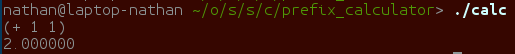
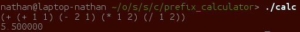

# Lisp Calculator
## Motivation
Lisp is commonly used as a first class functional programming language. In this example, we have built a lisp like calculator to explore and understand how to use BISON and FLEX.

## Yacc Grammatical Rules
Yacc requires grammatical rules to parse and make the abstract syntax tree. We choose to base our rules around finding parenthesis and their following functions. Here we see a `'(' '+'` reduced to an A token initialized with the value of 0. Then following A F patterns are absorbed into the A token and added to the result. Finally, once the tree has been reduced to an F, its value is printed out.

YACC grammar for a fully functional lisp like calculator that can add positive and negative numbers.
~~~
S : F           {printf("%f\n", $1);} // Print out final value
  ;

A : '(' '+'     {$$ = 0;}       // Initialize A token with value 0
  | A F         {$$ = $1 + $2;} // Subsequent F tokens are added to A token
  ;

F : NUM         {$$ = $1;}  // All NUM's become F token
  | '-' F       {$$ = -$2;} // Handle negative numbers
  | A ')'       {$$ = $1;}  // Reduce A token to F once parenthesis close
  ;
~~~

## How to build
`make calc`

## Examples
(+ 1 1) = 2  

(+ (+ 1 1) (- 2 1) (* 1 2) (/ 1 2)) = 5.5  

